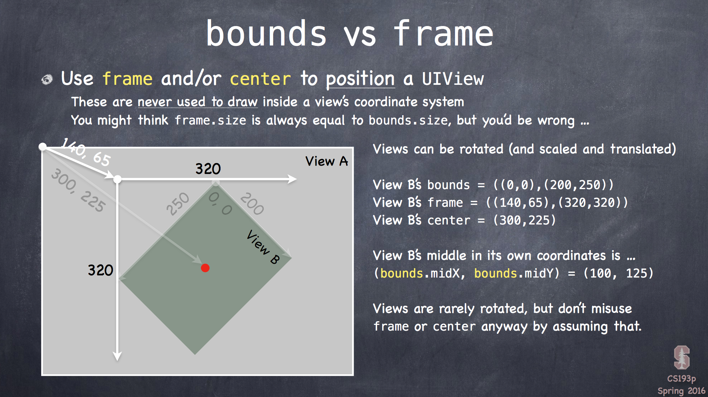

iOS自学，swift语言，了解OC，跟随Stanford CS 193P (Spring 2015-16)学习。
之前有学习Stanford CS 193P Winter 2014-2015，但是没有做什么笔记，只是完成作业，并且还自学了部分iOS开发。
但swift更新


## iOS系统4层

* Core OS


* Core Services


* Media


* Cocoa Touch


## MVC

* 将应用程序分成三个阵营。
	* Model
		* 描述应用是做什么的（what）。
		* 通过Notification & KVO和Controller通信。类似广播站。
	* Controller
		* 表示如何将Model展示（how）。
		* 可以直接和Model通信。
		* 可以直接和View通信（outlet）。
		* Controllers interpret/formal Model information for the View.
	* View
		* 是Controller的下属（minion）。
		* delegate：通过protocol的方式实现，将View中需要的部分放到Controller中，通过这种方式进行blind的通信。
		* data source：View不保留数据，所以Controller也作为data source，告诉View数据。

## View

一个View(`UIView`和子类)表示一个矩形区域。
在该矩形区域内存在一个坐标系，左上为坐标原点，向右Y增大，向下X增大。

* Hierarchicla


	一个view只有一个superview`var superview: UIView?`	
	一个view可以有多个subviews`var subviews: [UIView]`
	
* UIWindow
	
	在整个app中只包含一个`UIWindow`

通常通过图形界面建立View，但也可以通过代码建立。

`addSubview(aView: UIView)` 发送给superview

`removeFromSuperview()`发送给需要删除的view

对于一个Controller，存在着一个property: 

`var view: UIView`：

* 它指向最顶层(top level)的view

* 它决定了整个View的边界(bounds)

### Initializing

通常（其他的类也一样）尽量不要使用initializer，

	有可能的话，也不要去实现initializer

如果需要initialzer，那么需要同时实现下面两者：

* `init(frame: CGRect)`: 从代码中生成UIView
* `init(coder: NSCoder)`: 从Storyboard中生成UIView

### Coordinate System Data Structures

* `CGFloat`: 当需要在coordinate system使用Double或Float时，需要转换成这个类型
* `CGPoint`: `struct`，包含`x`和`y`两个`CGFloat`
* `CGSize`: `struct`，包含`width`和`height`两个`CGFloat`
* `CGRect`: 

```swift
struct CGRect {
	var origin: CGPoint
	var size: CGSize
}
```

用来表示一块区域，根据`origin`知道左上角位置，`size`得到大小

包含以下可用properties和functions：

* `var minX: CGFloat` 左边，当然还有右边
* `var midY: CGFloat` 水平中值
* `intersects(CGRect) -> Bool` 判断两个`CGRect`是否有重叠的部分
* `intersect(CGRect)` 得到两个`CGRect`重叠的部分，成为新的`CGRect`，如果没有，那么`x`和`y`无限大(得到的为`inf`)，`width`和`height`为0
* `contains(CGPoint) -> Bool` 判断该点是否在矩形内

#### Coordinate System

左上角为(0, 0)
向右x增大，向下y增大

在这个系统中，使用point而不是像素（pixels，不同设备下，point对应不同数量的pixels，plus有3个像素，6只有2个）

可以通过设置`var contentScaleFactor: CGFloat`来设置

`bounds`是针对该View而言的边界大小，而`frame`和`center`是针对其superView而言的位置信息



### 自定义View

* Core Graphics（C-like，非面向对象的方法）
	1. 通过`UIGraphicsGetCurrentContext()`得到一个context
	2. 画边
	3. 设置属性（颜色，字体，文字，宽度）
	4. 填充(fill)或只是画边(stroke)
* UIBezierPath类（面向对象方法）
	1. `let path = UIBezierPath()`创建一个对象
	2. `moveToPoint(_:)`,`addLineToPoint(_:)`,`closePath()`等方法移动点和创建直线或曲线
	3. `UIColor`下的`setFill()`和`setStroke()`完成填充或描边（**不是`UIBezierPath`的方法**）
	4. `linewidth`设置宽度
	5. `fill()`和`stroke()`完成填充或描边

### UIColor

可以用来设置颜色

其中包含一些type properties，如`green`来得到标准颜色

对于一个`UIView`，可以获取其背景颜色`var backgroundColor: UIColor`

### Transparency

在iOS中，用Alpha表示透明度。0.0(完全透明)~1.0(完全不透明)

对于颜色，可以设置其透明度，为实例方法

`let transparentYellow = UIColor.yellowColor().colorWithAlphaComponent(0.5)`

对于**View**，也可以设置透明度
`var opaque = false`才可以设置其alpha值

`var hidden: Bool`来让某个view先消失，等到需要时出现，但还是在inheritance。

### Drawing Text

一般使用`UILable`，但可以在`drawRect`下使用`NSAttributedString`来设置文字。

```
let text = NSAttributedString("hello")
text.drawAtPoint(aCGPoint)
let textSize: CGSize = text.size
```

OC遗留问题：

1. 还有`NSMutableAttributedString("some thing")`来设置可更改的字符串
2. 设置attribute时，需要注意为NSRange而不是Range。 

### Font

在iOS开发中，字体的要求相对较高，为的是整体的风格要和iOS一致。

`UIFont`是iOS中关于字体的类。
有三种方式来改变字体：

* 根据需要文本的风格，使用系统推荐的方式更改字体
	
	`static func preferredFontForTextStyle(UIFontTextStyle) -> UIFont`
	
	UIFontTextStyle: .Headlin, .Body, .Footnote

* "system fonts"

	用于button等地方，不属于用户内容的。
	
	`static func systemFontOfSize(pointSize: CGFloat) -> UIFont`
	
	`static func boldSystemFontOfSize(pointSize: CGFloat) -> UIFont`
	
* 特殊的方式

	在UIFont和UIFontDescriptor中有更多字体。
	
### Images

一般通过`UIImageView`

`image.drawAtPoint(aCGPoint)`等可以在drawRect中使用。

## Gestures

1. 添加一个gesture recognizer到需要的view中（一般在controller中完成）
2. 添加一个方法（不一定由UIView管理，取决于手势的作用）


## Multiple MVCs

其他MVCs作为其中一个Controller的View。

通过`var viewControllers: [UIViewController]? { get set }`设置，但是一般不使用set。

### Segues

主要的四个：

* show: push in a Navigation Controller
* Show Detail: show in Detail of a Split View or push in a Navigation Controller
* Modal: take over the entire screen.
* popover: show in a little popover window

segue永远都是创造一个新的MVC

Ctrl-drag来添加segue，每一个segue都需要有一个`identifier: String`。

#### Preparing for a Segue

根据`segue: UIStoryboardSegue`和`sender: AnyObject?`来确定目标MVC，并设置controller中的值。

## Memory Management

存在三种指针形式

* strong：默认形式，当一个强指针指向一个实例，那么它永远存在于heap中。
* weak：`weak`永远不会将对象保存在heap中。
* unowned：不将它放入ARC中，如果不使用了，那么就丢掉它。

## Closures

存在在heap中，reference types。

## Extensions

可以扩展（但不是重新实现）已存在的数据结构，添加方法或者添加properties。

Extension要足够简洁。

## Protocols

protocol是一种类型，但是需要caller去实现。

1. 先定义protocol，包括method和properties。
2. 然后需要使用的class，struct，enum声明要实现。
3. 之后实现，也可以通过extension实现。

通过`@obj`来确定protocol可以有optional的methods或properties，否则都需要实现。通过`optional`来选择。

	可以将相同protocol的data type放到一起。如放入array。
		
### Delegation

delegation是protocol一个重要的使用的地方。

1. View提供Protocol作为delegate或datasource。
2. View API有一个`weak delegate`，类型为该Protocol。
3. View通过这个`delegate`获得一些（或做一些）自己无法控制的事情。
4. Controller声明并实现该protocol
5. 在Controller中，`view.delegate = self`来使delegate变成Controller。


## 创建ScrollView

1. 首先要定义scrollView的大小 ！

	`scrollView.contentSize = CGSize(width: 3000, height: 2000)`


2. 之后就可以向scrollView中添加子视图

	`logo.frame = CGRect(x: 150, y:200, width: 2500, height: 1600)`

	`scrollView.addSubview(logo)`

	同时可以改变子视图的大小或位置

	`logo.frame = CGRect(x: 0, y: 0, width: 2500, height: 1600)`

	或改变scrollView的大小

	`scrollView.contentSize = CGSize(width: 2500, height: 1600)`

可以通过`scrollView.contentOffset`获取当前位置信息

`let upperLeftOfVisible: CGPoint = scrollView.contentOffset`

### 改变

#### Zooming

`scrollView.minimumZoomScale = 0.5`

`scrollView.maximumZoomScale = 2.0`

需要实现`func viewForZoomingInScrollView(sender: UIScrollView) -> UIView`

可以设置`zoomScale`来改变放大的大小。

## Multithreading

在iOS中，多线程表现为“queues”，将不同的functions放到不同的queue中进行执行即可。

### Main Queue

所有的UI都在这条队列中，所有非UI但占时的不要放到这个队列中

### Executing 

先获取队列，然后将需要的代码放入队列

```
let queue: dispathc_queue_t = // get the queue you want
dispatch_async(queue) { /* do what you want to do here */}
```

这种方法会立刻return，因为该段代码的作用就是将代码放到相应的队列（或者说是线程），然后继续执行其他代码，等到轮到该执行的时候开始执行。

### Other Queues

```
QOS_CLASS_USER_INTERACTIVE // 
QOS_CLASS_USER_INITIATED // 需要比较多的时间
QOS_CLASS_UTILITY // 长时间操作
QOS_CLASS_BACKGROUND
```

或者建造自己的队列

`let serialQ = dispatch_queue_create("name", DISPATCH_QUEUE_SERIAL)`

### OO-API

`NSOperationQueue`和`NSOperation`为面向对象的方法，如果需要两个操作之间有关联（如一个要等到另一个执行完才可以继续执行），则可以使用它们

## Text Field

当用户点击它的时候，或`becomeFirestResponder()`可以激活键盘。

通过`resignFirstResponder()`来隐藏键盘。

`func textFieldShouldreturn(sender: UITextField) -> Bool`当回车按下时，可以调用上述方法来使键盘消失掉。
