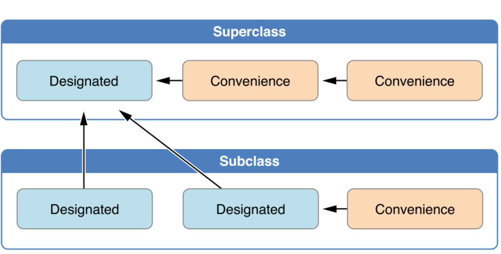

# Initialization

这一章的重要性较高。

1. 在swift中包含两种`init()`。
2. `init()`本身如果可以，尽量不使用，除非涉及到本身无法初始化的propertise。
3. 同时controller本身的`init()`较为复杂

## 设置初始化值

class和struct必须初始化所有stored properties。

	在class
	1. 可以设置lazy暂时不设置值
	2. 可以为optional默认为nil
	3. 可以设置默认值
	4. 可以在init中设置值

	这些都不会调用property observers
	
如果每次值都一样，使用default value，因为离定义更近，使init更简洁。

## Default Initialization

当所有properties都有默认值时，可以不自定义构造函数，而是swift提供一个空参数的默认构造函数。

对于`struct`，swift提供一个默认的接收所有properties的构造函数（memberwise initializer），按照属性名称作为参数名。

	当自定义构造函数后，默认构造函数就不存在了。
	
## Initializer Delegate for Value Type

当提供多个构造函数时，可以通过调用其他构造函数简化代码。

由于Value Type是无法继承的，所有调用的都是自己的构造函数。

	如果想使用自定义构造函数，又想保留默认构造函数。
	需要在extention中添加自定义构造函数以保留默认构造函数。

## Class Inheritance and Initialization

在class中有两种initializer

### Designated Initializer and Convenience Initializer。
 
所有的类必须包含至少一个Designated Initializer。（最好也只有一个）

所有类不必须包含Convenience Initializer。需要写关键字`convenience`

### Initializer Delegation for Class Type

必须满足三个规则：

1. Designated initializer 必须调用其superclass的Designated initializer
2. Convenience initializer必须调用同一类中的其他initializer
3. Convenience initializer必须最终调用一个Designated initializer


		
	Designated向上调用。Convenience向旁边调用。
		
### Two-Phase

第一阶段：保证所有的properties都有值。当最后一个designated initializer被调用时，完成所有properties初始化时结束。

第二阶段：在初始化完成前，自定义值。所有properties被定义后，开始从最顶端的designated initializer开始到最后一个initializer。

这里涉及四个安全检查，由编译器帮助完成，也就是在编译阶段就会发现问题：

1. designated initializer**必须保证所有本类的properties都被初始化，才能调用父类的initializer。
2. designated initializer必须调用父类initializer，才能更改superclass的properties。
3. convenience initializer必须调用其他initializer才可以assigning a value to **any** property。
4. 第一阶段完成前，不可以调用任何方法，properties，甚至self。

### Initializer Inheritance and Overriding

当重写initializer时，如果是designated initializer，则需要写`override`来保证唯一性。即使子类实现的是convenience initializer。

但convenience initializer本身只能调用同一类的构造函数，所以不需要些`override`关键字，但是这样子类永远不能调用父类的相同的convenience initializer。

#### Automatic Initializer Inheritance

当满足某些条件的时候，构造函数会被自动继承。

1. 如果子类没有定义任何designated initializer，那么自动继承所有父类的designated initializer
2. 如果子类提供实现了所有父类的designated initializer（根据规则一继承或自定义实现所有initializer，都可以），那么自动继承所有父类的convenience initializer。

## Failable Initializers

可以通过`init?`，来定义可失败构造函数。当无法完成初始化的时候，可以`return nil`来使构造函数失败。

可失败构造函数可以和其他构造函数参数一致。

### for Enumerations

当无法符合任何一个类型的时候，可以通过可失败构造函数返回一个`nil`。

根据`rawValue`的构造函数自动为可失败构造函数。

### Propagation of Initialization Failure

可失败构造函数可以调用其他构造函数（包括可失败构造函数和一般的构造函数），当任何一个地方`return nil`，那么整个构造函数会立刻停止。

### Overriding a Failable Initializer

可以将一个可失败构造函数重写为一个不可失败的构造函数。**但不可以反过来**。

## Required Initializers

通过`required`关键字，所有的子类必须实现该initializer。

	如果继承的构造函数满足需求，那么不必须实现该函数。
	
## Setting a Default Property Value with a Closure or Function

可以通过Closure或者Function来定义一些`let`或`lazy var`

## Deinitializer

当实例被销毁时，需要做的一些工作可以在析构函数中完成。如：关闭文件，


当使用`=`或设定为`Optional`，或使用了`lazy`，这些时候都不需要使用`init`

当这些方法都不可以的时候，就需要使用`init`方法了。

## “free” init methods

Class：当所有的properties都有默认值（optional，默认值，或者lazy），就可以得到一个free init

Struct：会得到一个系统提供的，有所有变量名作为参数的init。

## 可以做

* 可以设置所有的值，包括有默认值的properties
* 可以这是常量`let`
* 可以调用其他的，该类自己的init方法`self.init(<args>)`
* 可以调用父类的init方法

## 必须做

* 当init结束时，所有的值必须被赋值（optional可以为nil）
* 有两种类型的init：convenience（设有关键字`convenience`）和designated
* designated init必须（只能）调用其父类的designated init
* 先设定该类的properties值，调用父类init，再去更改父类继承的properties
* convenience init必须（也只能）调用自己类的init
* convenience init必须调用init后，才可以设定值

## 继承init

如果没实现任何一个designated init，那么继承所有父类的designated
如果重写了父类所有的designated，那么继承所有的convenience
如果没实现init，那么继承所有父类的init

`required`可以要求子类必须实现该init

## Failable init

init可以失败，如果失败，返回一个nil。
```
init?(arg1: Type1, ...) {
}
```


